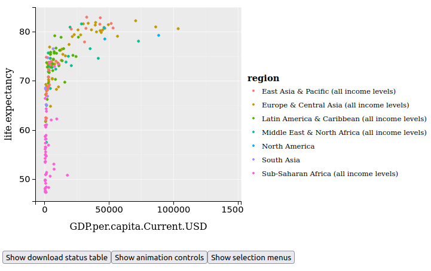

# Introduction au logiciel de data Visualisation animint2

Dans ce mini tp, j'essaie de dégager le rapport entre PIB/Habitant et espérance de vie dans les pays du monde.
Pour cela, on utilise un dataset de la banque mondiale et on ne represente les données que pour l'année 2010.

Comme hypothèse, je me suis dis que l'espérance de vie augmente avec le PIB/Habitant car plus un pays est riche, plus il investi dans le niveau de vie de sa population qui vit alors plus longtemps.

La visualisation des données me permet effectivement de constater une courbe relativement croissante, ce qui confirme mon hypothèse.

Je vois aini que les pays de régions au faibles PIB/habitant, comme l'Afrique subsaharienne, ont des expériences de vie en dessous de 60 ans tandis que des régions comme l'Amérique du Nord ou l'Europe avec de plus gros PIB/Habitant ont de plus longues expériences de vie, à plus de 70 ans.

Conclusion: L'espérance de vie croît avec le BIP/Habitant (pour 2010 au moins).

